# Manual Penggunaan — BSN Lacak

Panduan singkat penggunaan aplikasi **BSN Lacak** (Sistem Tracking Penagihan
Bank Syariah Nasional) dari sudut pandang Supervisor cabang. Seluruh tangkapan
layar di dokumen ini dihasilkan otomatis oleh skrip Playwright — lihat bagian
[Regenerasi screenshot](#regenerasi-screenshot) untuk memperbaruinya setelah
ada perubahan UI.

> Akun demo (mode mock): `supervisor` / `Sekret123!ABCD`

---

## Daftar isi

1. [Masuk ke aplikasi](#1-masuk-ke-aplikasi)
2. [Dashboard](#2-dashboard)
3. [Kolektabilitas](#3-kolektabilitas)
4. [Blast SMS / WhatsApp](#4-blast-sms--whatsapp)
5. [Tracking Petugas](#5-tracking-petugas)
6. [Pencarian global (Ctrl+K)](#6-pencarian-global-ctrlk)
7. [Kalender Cuti](#7-kalender-cuti)
8. [Tracker Janji](#8-tracker-janji)
9. [Dispute Absensi](#9-dispute-absensi)
10. [Laporan KM](#10-laporan-km)
11. [Tukar Nasabah](#11-tukar-nasabah)
12. [Pengaturan akun](#12-pengaturan-akun)
13. [Regenerasi screenshot](#regenerasi-screenshot)

---

## 1. Masuk ke aplikasi

Buka aplikasi di browser. Form login akan tampil kosong:


Isi **Username** dan **Password**. Tombol **Masuk** baru aktif setelah kedua
kolom diisi:

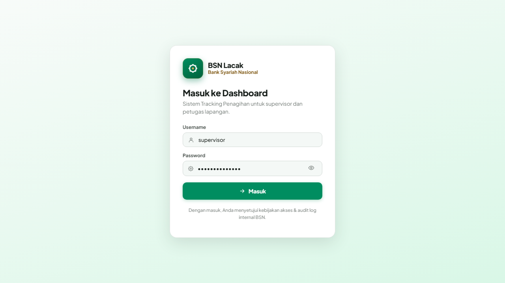

Klik **Masuk**. Untuk akun dengan 2FA aktif, sistem akan menampilkan dialog
verifikasi kode 6 digit.

---

## 2. Dashboard

Setelah login, Supervisor langsung tiba di **Dashboard** — ringkasan
operasional cabang Anda hari ini:

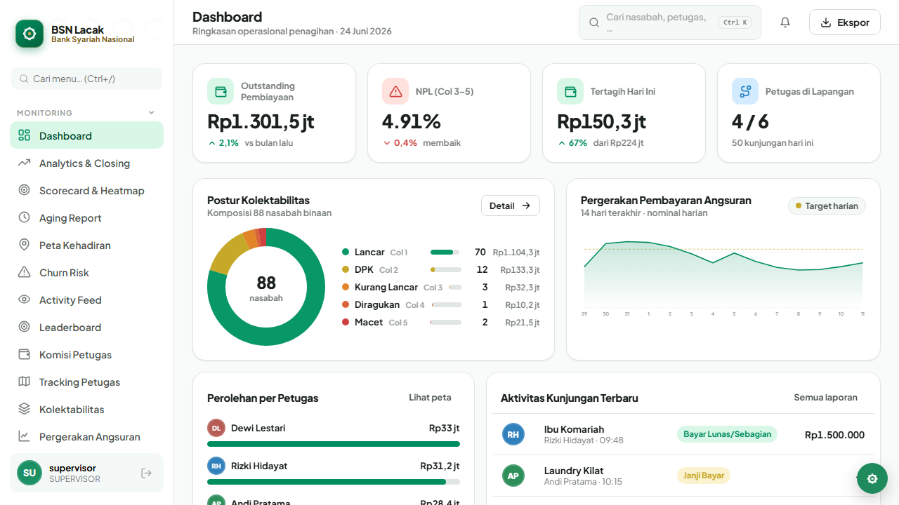

Yang ditampilkan:

- **Empat KPI atas** — Outstanding pembiayaan, NPL (Col 3–5), Tertagih hari
  ini, dan jumlah Petugas di lapangan.
- **Postur Kolektabilitas** — donut chart komposisi nasabah binaan per kolom
  kolektabilitas (Col 1 Lancar → Col 5 Macet).
- **Pergerakan Pembayaran Angsuran** — kurva nominal harian 14 hari terakhir
  vs garis target harian.
- **Perolehan per Petugas** — bar collection bulan berjalan per petugas.
- **Aktivitas Kunjungan Terbaru** — feed kunjungan paling baru beserta hasil.

Klik **Detail →** pada panel Postur untuk membuka halaman Kolektabilitas dengan
filter sesuai kolom yang Anda pilih.

---

## 3. Kolektabilitas

Halaman ini memperlihatkan komposisi akad pembiayaan dan daftar nasabah binaan
yang dapat di-filter per kolom kolektabilitas:

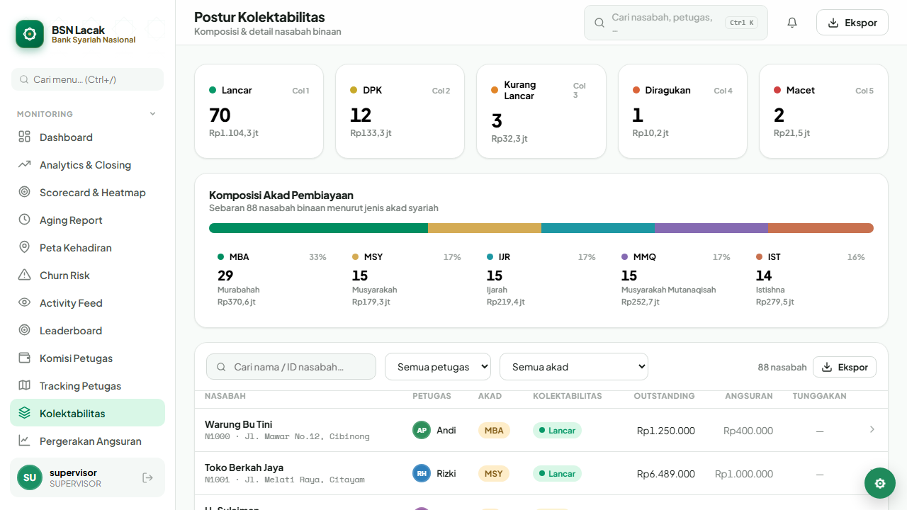

Tips:

- Gunakan kotak pencarian di atas tabel untuk filter cepat berdasarkan nama
  atau ID nasabah.
- Klik baris nasabah untuk membuka panel detail (akad, plafon, tenor, sisa
  pokok, DPD, jadwal angsuran).

---

## 4. Blast SMS / WhatsApp

Modul ini dipakai untuk mengirim pengingat jatuh tempo massal:

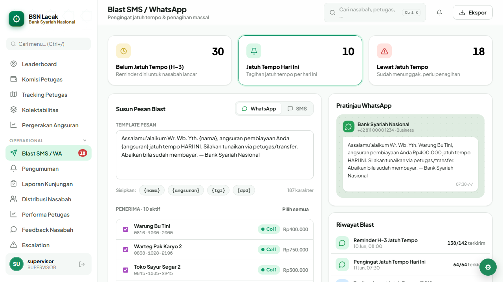

Alur kerja:

1. Pilih **segmen target** — *Belum Jatuh Tempo (H-3)*, *Jatuh Tempo Hari Ini*,
   atau *Lewat Jatuh Tempo*. Angka di tiap kartu = jumlah nasabah terkena
   segmen.
2. Pilih **kanal** (SMS atau WhatsApp).
3. Pesan template otomatis terisi dengan placeholder `{nama}`, `{angsuran}`,
   `{tgl}`, `{dpd}`. Sunting bila perlu.
4. Tinjau **preview** sebelum klik **Kirim**.

Riwayat blast (terkirim / dibaca / status) tampil di bagian bawah halaman.

---

## 5. Tracking Petugas

Live map posisi petugas + ringkasan rute hari ini:


Pada panel kiri:

- Status tiap petugas: **Di Lapangan / Istirahat / Di Kantor**.
- Indikator kunjungan tercapai vs rencana harian.
- Klik salah satu petugas → peta zoom ke posisi terakhirnya, dan panel bawah
  menampilkan **Lintasan Pergerakan** beserta ringkasan kunjungan terakhir.
- **Dua toggle** di atas daftar petugas:
  - *Tampilkan semua rute di peta* — overlay rute terencana seluruh petugas
    (default on).
  - *Tampilkan jejak kunjungan* — overlay marker per laporan kunjungan
    petugas terpilih (default off). Lihat bagian berikut.

Marker di peta diperbarui realtime via SSE saat petugas clock-in / mengirim
ping posisi.

### 5a. Jejak Kunjungan (audit kepatuhan rute)

Centang **"Tampilkan jejak kunjungan"** untuk menambahkan overlay history
laporan kunjungan petugas terpilih ke peta:

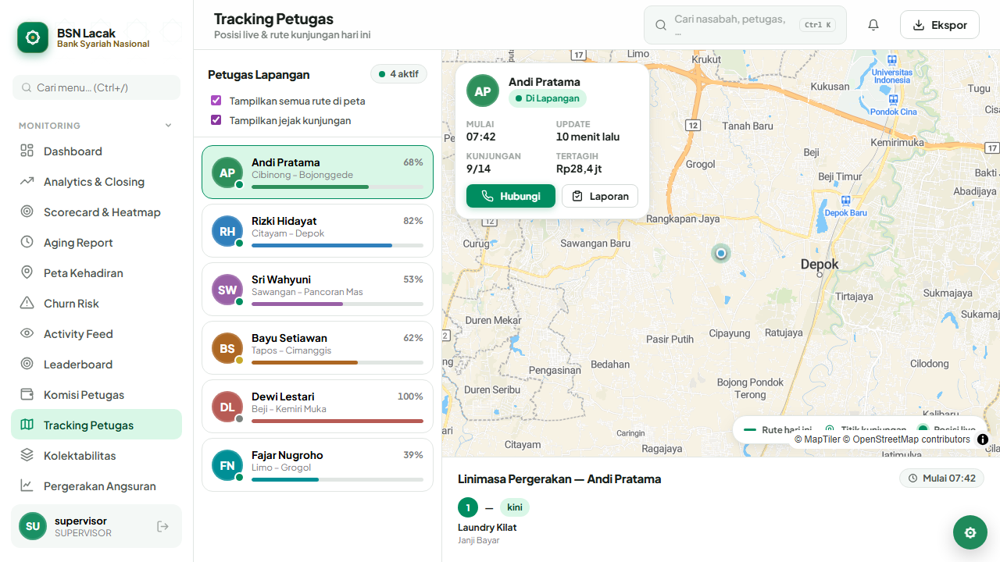

Yang ditampilkan:

- **Marker bulat bernomor (1, 2, 3, …)** di setiap titik GPS petugas saat
  laporkan kunjungan, **urut kronologis** dari paling awal.
- **Warna marker per hasil**:
  - 🟢 Hijau = Bayar
  - 🟡 Amber = Janji Bayar
  - ⚪ Abu = Tidak di Tempat
  - 🔴 Merah = Menolak/Kabur
- **Garis putus-putus** menghubungkan urutan kronologis 1 → 2 → 3 → … —
  menggambarkan path aktual yang dilewati petugas.
- **Hover marker** → tooltip menampilkan jam laporan, nama nasabah, hasil,
  dan nominal pembayaran.

Kegunaan praktis:

- **Audit kepatuhan rute** — bandingkan jejak (warna campur) dengan rute
  terencana (garis tebal). Petugas yang konsisten skip nasabah tertentu
  akan terlihat polanya.
- **Verifikasi laporan** — laporan tanpa GPS fix (petugas izinkan location
  off) tidak muncul di overlay — supervisor bisa flag untuk review.
- **Deteksi anomali** — jejak yang melompat jauh dari rute terencana atau
  cluster timestamp berdekatan tapi GPS jauh = indikasi false reporting.

> Catatan: kalau jejak kosong walau toggle on, kemungkinan petugas yang
> dipilih belum pernah lapor kunjungan dengan GPS aktif (atau semua
> laporannya dari area tanpa sinyal). Pilih petugas lain dari sidebar
> kiri.

---

## 6. Pencarian global (Ctrl+K)

Tekan **Ctrl+K** (Windows) / **⌘+K** (Mac), atau klik kotak pencarian di
topbar:

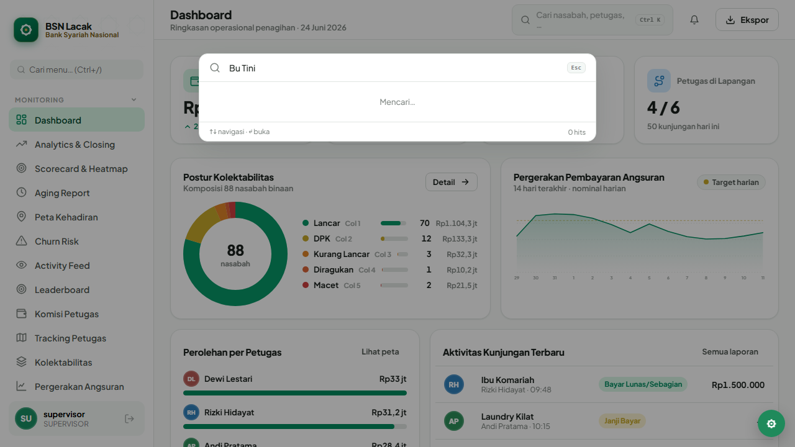

Pencarian mencakup nasabah, petugas, kunjungan, blast, dan wilayah dalam
sekali query. Hasil dikelompokkan per entitas; klik salah satu entry langsung
melompat ke halaman yang sesuai. Tutup dialog dengan **Esc**.

---

## 7. Kalender Cuti

Visualisasi 30 hari pengajuan cuti petugas lintas cabang:

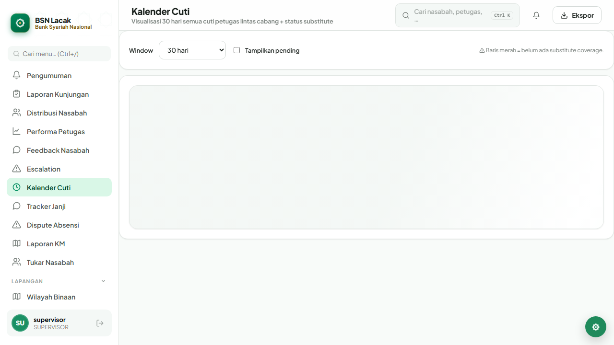

Kontrol:

- **Window**: 14 / 30 / 60 / 90 hari.
- **Tampilkan pending**: centang untuk memasukkan pengajuan yang belum
  diapprove.
- **Baris merah** = belum ada substitute coverage (substitute petugas belum
  ditunjuk). Tugaskan substitute lewat menu Kelola Petugas → tab Cuti.

---

## 8. Tracker Janji

Memantau janji bayar nasabah dari hasil kunjungan: ditepati, wanprestasi,
atau masih menunggu deadline:


- Filter chip status di kanan: **Ditepati / Wanprestasi / Menunggu**.
- Window 7 / 14 / 30 / 60 hari.
- Janji yang melewati deadline tanpa pembayaran otomatis berstatus
  **Wanprestasi** dan mengirim notifikasi follow-up ke petugas pengampu.

---

## 9. Dispute Absensi

Antrian dispute clock-in / clock-out yang diajukan petugas:

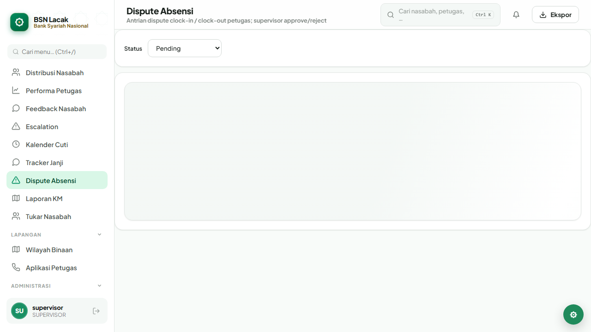

Tindakan Supervisor:

- **Approve** — sistem akan menulis ulang jam clock-in/out sesuai usulan
  petugas.
- **Reject** — beri alasan; petugas mendapat notifikasi.
- Default filter **Pending** sehingga Anda hanya melihat antrian aktif.

---

## 10. Laporan KM

Total kilometer tempuh petugas berdasarkan odometer clock-in/out — basis
klaim BBM bulanan:

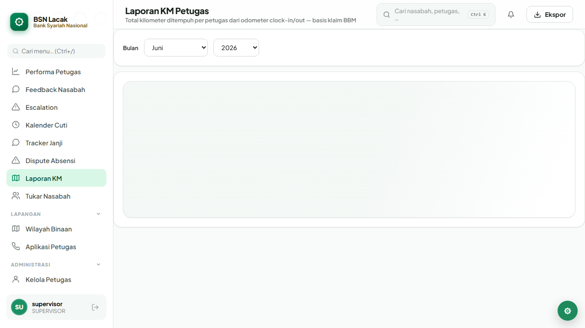

- Pilih **bulan & tahun** di atas.
- Total agregat seluruh petugas tampil di kanan; tabel dirinci per petugas
  beserta plat kendaraan dan jumlah sesi.

Ekspor CSV tersedia lewat tombol **Ekspor** di topbar.

---

## 11. Tukar Nasabah

Pengajuan tukar nasabah antar petugas dalam cabang yang sama:

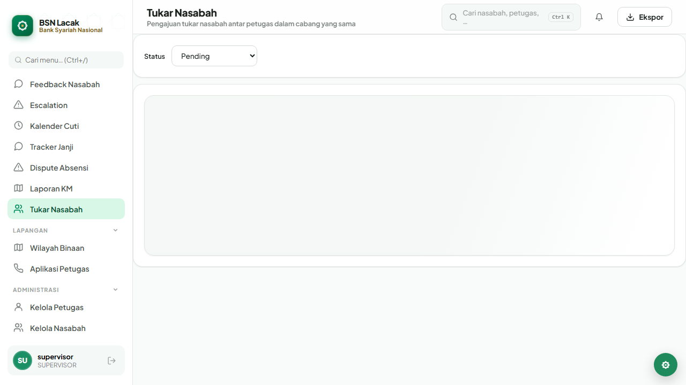

- Petugas mengajukan dari aplikasi mobile; Supervisor approve / reject di
  layar ini.
- Setelah disetujui, kepemilikan dua nasabah otomatis tertukar dan log audit
  tercatat.

---

## 12. Pengaturan akun

Klik kartu profil di pojok kiri bawah sidebar untuk membuka pengaturan
pribadi:

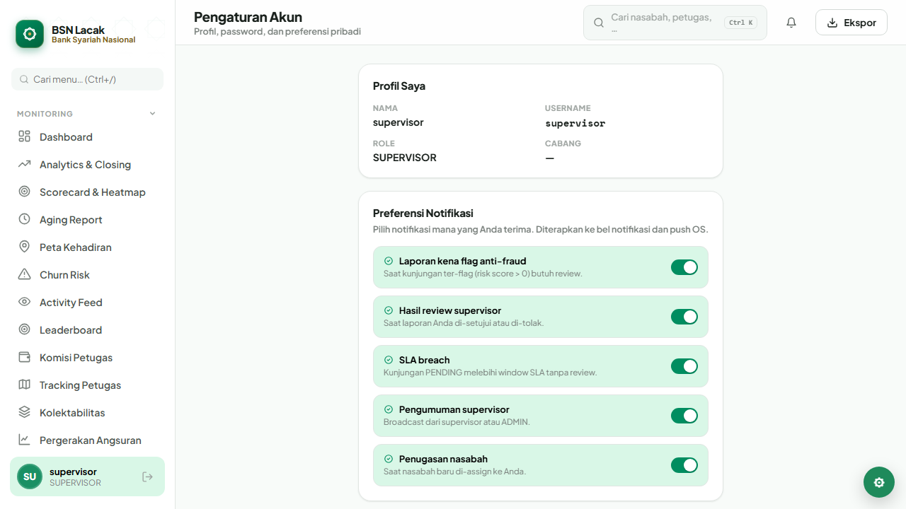

Yang dapat diatur:

- Profil dasar (nama tampilan).
- Ganti password.
- Aktifkan / nonaktifkan 2FA (TOTP).
- Preferensi tampilan: tema, font, density (dipindah ke panel *tweaks* di
  pojok kanan bawah).

---

## Regenerasi screenshot, HTML & PDF

Manual ini tersedia dalam tiga format:

| Format   | File                                |
|----------|-------------------------------------|
| Markdown | `docs/MANUAL_PENGGUNAAN.md`         |
| HTML     | `docs/MANUAL_PENGGUNAAN.html` (gambar di-embed base64, satu file) |
| PDF      | `docs/MANUAL_PENGGUNAAN.pdf` (A4, 8 hal., dengan header/footer)   |

Pipeline regenerasi setelah ada perubahan UI:

```bash
cd web

# 1. Capture ulang screenshot dari aplikasi (mode mock).
npm run manual:capture

# 2. Render ulang HTML + PDF dari markdown.
npm run manual:render
```

Apa yang terjadi di balik layar:

1. **`manual:capture`** — Spec Playwright `e2e/manual-capture.spec.ts`
   menyalakan Vite dev server (`VITE_USE_MOCK=true`), login sebagai
   `supervisor`, lalu navigasi ke setiap layar dan menyimpan PNG ke
   `docs/manual/screenshots/`. Spec ini di-*skip* pada `npm run test:e2e`
   biasa (gate via env `CAPTURE_MANUAL=1`) supaya regression run tetap cepat.
2. **`manual:render`** — Skrip `scripts/render-manual.mjs` membaca markdown,
   meng-convert ke HTML via `marked`, meng-embed PNG sebagai data URI, lalu
   memakai Playwright Chromium untuk mencetak versi PDF dengan margin A4
   dan footer nomor halaman.
